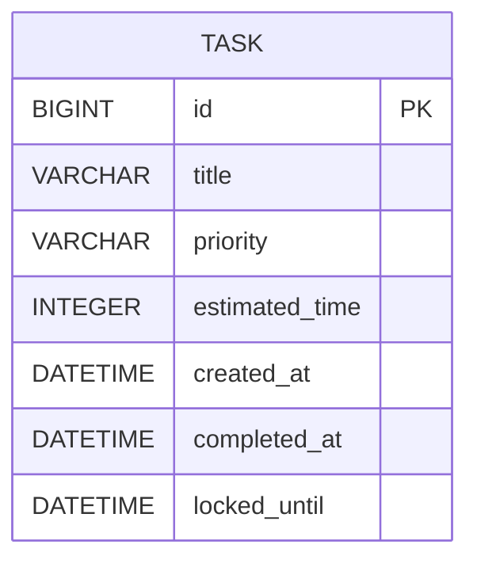
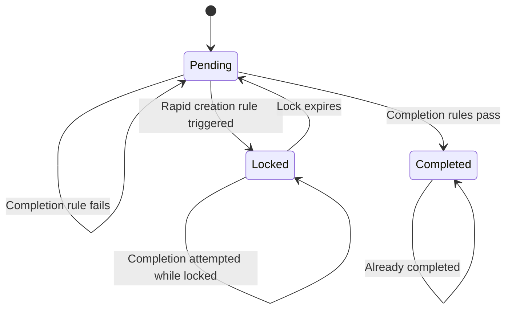
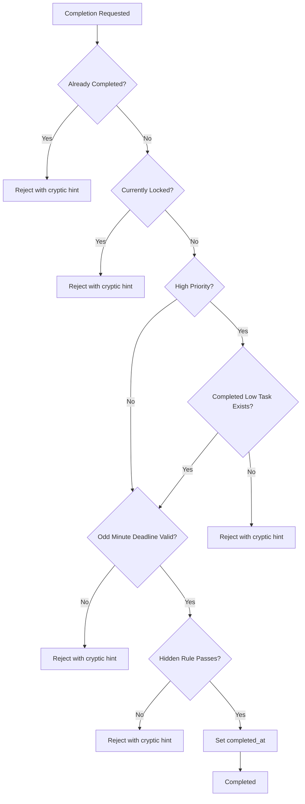
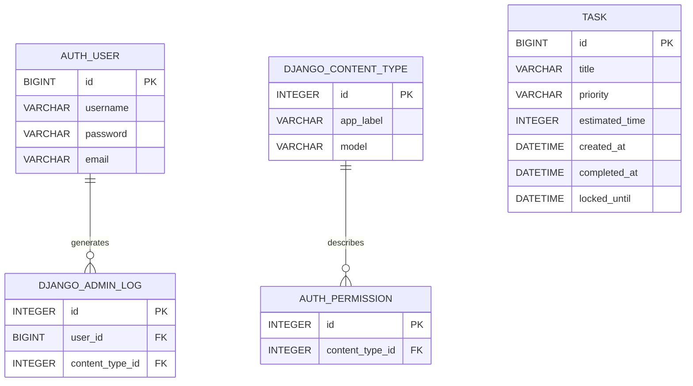

# Smart Task Board Database Documentation

## 1. Overview

Smart Task Board uses Django ORM with SQLite as the project database.

The application's primary domain entity is:

```text
Task
```

Django also automatically creates framework-related tables for authentication, administration, migrations, sessions, and content types.

This document focuses primarily on the application's domain schema.

---

## 2. Database Technology

| Property               | Value             |
| ---------------------- | ----------------- |
| Database Engine        | SQLite            |
| ORM                    | Django ORM        |
| Database File          | `db.sqlite3`      |
| Migration System       | Django Migrations |
| Main Application Table | `tasks_task`      |

---

## 3. Entity Relationship Diagram



The application requires one primary domain entity.

---

## 4. Logical ER Diagram

```text
+--------------------------------------------------+
|                       TASK                       |
+--------------------------------------------------+
| PK  id                 BIGINT                    |
|     title              VARCHAR(200)              |
|     priority           VARCHAR(10)               |
|     estimated_time     POSITIVE INTEGER          |
|     created_at         DATETIME                  |
|     completed_at       DATETIME NULL             |
|     locked_until       DATETIME NULL             |
+--------------------------------------------------+
```

---

## 5. Task Table

Django model:

```text
tasks.models.Task
```

Database table:

```text
tasks_task
```

### Schema

| Column           | Data Type        | Null | Key         | Description                                 |
| ---------------- | ---------------- | ---: | ----------- | ------------------------------------------- |
| `id`             | INTEGER / BIGINT |   No | Primary Key | Unique task identifier                      |
| `title`          | VARCHAR(200)     |   No |             | Task title                                  |
| `priority`       | VARCHAR(10)      |   No |             | Task priority                               |
| `estimated_time` | INTEGER          |   No |             | Estimated task duration in minutes          |
| `created_at`     | DATETIME         |   No |             | Automatically generated creation timestamp  |
| `completed_at`   | DATETIME         |  Yes |             | Timestamp when task was completed           |
| `locked_until`   | DATETIME         |  Yes |             | Timestamp until which completion is blocked |

---

## 6. Priority Values

The `priority` field uses Django `TextChoices`.

Allowed values:

```text
LOW
MEDIUM
HIGH
```

| Stored Value | Display Value |
| ------------ | ------------- |
| `LOW`        | Low           |
| `MEDIUM`     | Medium        |
| `HIGH`       | High          |

---

## 7. Field Details

### `id`

Primary key automatically managed by Django.

Purpose:

* Uniquely identifies each task
* Used when completing a task
* Participates in deterministic hidden-rule logic

---

### `title`

```python
title = models.CharField(
    max_length=200
)
```

Purpose:

Stores the task title.

---

### `priority`

```python
priority = models.CharField(
    max_length=10,
    choices=Priority.choices,
)
```

Possible values:

```text
LOW
MEDIUM
HIGH
```

---

### `estimated_time`

```python
estimated_time = models.PositiveIntegerField(
    help_text="Estimated time in minutes"
)
```

Purpose:

Stores expected task duration in minutes.

For odd-minute tasks:

```text
deadline = created_at + estimated_time
```

---

### `created_at`

```python
created_at = models.DateTimeField(
    auto_now_add=True
)
```

Used by:

* Task ordering
* Two-minute rapid creation rule
* Odd/even minute calculation
* Completion deadline logic

---

### `completed_at`

```python
completed_at = models.DateTimeField(
    null=True,
    blank=True
)
```

Before completion:

```text
NULL
```

After completion:

```text
Timestamp
```

A task is completed when:

```text
completed_at IS NOT NULL
```

---

### `locked_until`

```python
locked_until = models.DateTimeField(
    null=True,
    blank=True
)
```

A task remains locked while:

```text
current_time < locked_until
```

After the expiry time passes, the task is treated as unlocked.

---

## 8. Derived Properties

The following values are not stored as database columns.

### `is_completed`

```python
@property
def is_completed(self):
    return self.completed_at is not None
```

---

### `is_locked`

```python
@property
def is_locked(self):
    if self.locked_until is None:
        return False

    return timezone.now() < self.locked_until
```

---

### `status`

Possible values:

```text
Pending
Locked
Completed
```

Calculation:

```text
IF completed_at IS NOT NULL
    -> Completed

ELSE IF locked_until IS NOT NULL
        AND current_time < locked_until
    -> Locked

ELSE
    -> Pending
```

---

## 9. Task State Diagram



---

## 10. Task Completion Decision Flow



---

## 11. High Priority Dependency

A High priority task checks the Task table for at least one completed Low task.

Equivalent logical query:

```sql
SELECT EXISTS (
    SELECT 1
    FROM tasks_task
    WHERE priority = 'LOW'
      AND completed_at IS NOT NULL
);
```

Django ORM implementation:

```python
Task.objects.filter(
    priority=Task.Priority.LOW,
    completed_at__isnull=False,
).exists()
```

---

## 12. Rapid Creation Lock Query

The service checks tasks created during the previous two minutes.

Conceptually:

```sql
SELECT COUNT(*)
FROM tasks_task
WHERE created_at >= :two_minutes_ago
  AND created_at <= :current_time;
```

If the result is at least three:

```text
locked_until = current_time + 5 minutes
```

Otherwise:

```text
locked_until = NULL
```

---

## 13. Odd-Minute Deadline

The application converts `created_at` into the configured local timezone.

Odd minute:

```text
minute % 2 = 1
```

Deadline is enforced.

Even minute:

```text
minute % 2 = 0
```

No additional deadline is enforced.

Example:

```text
Created:        09:31
Estimated:      20 minutes
Deadline:       09:51
```

---

## 14. Hidden Rule

The hidden rule does not require additional database fields.

It derives a deterministic hash from:

```text
task_id : title : estimated_time
```

Example:

```text
12:Write unit tests:30
```

The application calculates SHA-256 and applies an internal condition to determine whether completion is accepted.

No hidden-rule result is stored in the database.

---

## 15. Data Integrity Rules

### Required Fields

```text
title
priority
estimated_time
created_at
```

### Nullable Fields

```text
completed_at
locked_until
```

### Estimated Time

Application-level validation requires:

```text
estimated_time > 0
```

### Priority

Accepted values:

```text
LOW
MEDIUM
HIGH
```

---

## 16. Example Records

### Pending Low Task

```text
id              = 1
title           = "Read requirements"
priority        = "LOW"
estimated_time  = 10
created_at      = 2026-09-18 05:20:00
completed_at    = NULL
locked_until    = NULL
```

Derived status:

```text
Pending
```

---

### Completed Low Task

```text
id              = 2
title           = "Update README"
priority        = "LOW"
estimated_time  = 15
created_at      = 2026-09-18 05:22:00
completed_at    = 2026-09-18 05:27:00
locked_until    = NULL
```

Derived status:

```text
Completed
```

---

### Locked Task

```text
id              = 4
title           = "Prepare submission"
priority        = "HIGH"
estimated_time  = 30
created_at      = 2026-09-18 05:30:00
completed_at    = NULL
locked_until    = 2026-09-18 05:35:00
```

At `05:32`:

```text
Locked
```

At `05:36`:

```text
Pending
```

if the task has not been completed.

---

## 17. Django Framework Tables

Django creates framework tables such as:

```text
auth_group
auth_group_permissions
auth_permission
auth_user
auth_user_groups
auth_user_user_permissions

django_admin_log
django_content_type
django_migrations
django_session
```

These tables are managed by Django and are not part of the Smart Task Board business domain.

---

## 18. Database Relationship View



The `TASK` entity has no relationship with `AUTH_USER` because the assignment does not require user-specific task ownership.

---

## 19. Normalization

### First Normal Form

All task attributes contain atomic values.

### Second Normal Form

The Task table uses a single-column primary key.

All non-key attributes describe the Task entity.

### Third Normal Form

Derived values such as:

```text
status
is_locked
is_completed
```

are not duplicated as stored columns.

They are calculated from:

```text
completed_at
locked_until
```

This reduces redundant data and prevents inconsistent states.

---

## 20. Transaction Strategy

Task creation and completion use Django transactions.

```python
@transaction.atomic
def complete_task(task):
    ...
```

Task completion also uses:

```python
Task.objects.select_for_update()
```

This keeps the completion operation inside a controlled transaction.

---

## 21. Migration Management

Current application migration:

```text
tasks/migrations/0001_initial.py
```

Create migrations after model changes:

```bash
python manage.py makemigrations
```

Apply migrations:

```bash
python manage.py migrate
```

Inspect migration state:

```bash
python manage.py showmigrations
```

---

## 22. Database Design Summary

The database design prioritizes:

* Simplicity
* Clear business-rule support
* Minimal duplication
* Django ORM compatibility
* Time-based rule support
* Easy local setup

The single-domain-entity design is sufficient for the assignment requirements and keeps the implementation easy to understand and maintain.
